# Pomodoro Timer Forest

<p align="center">
  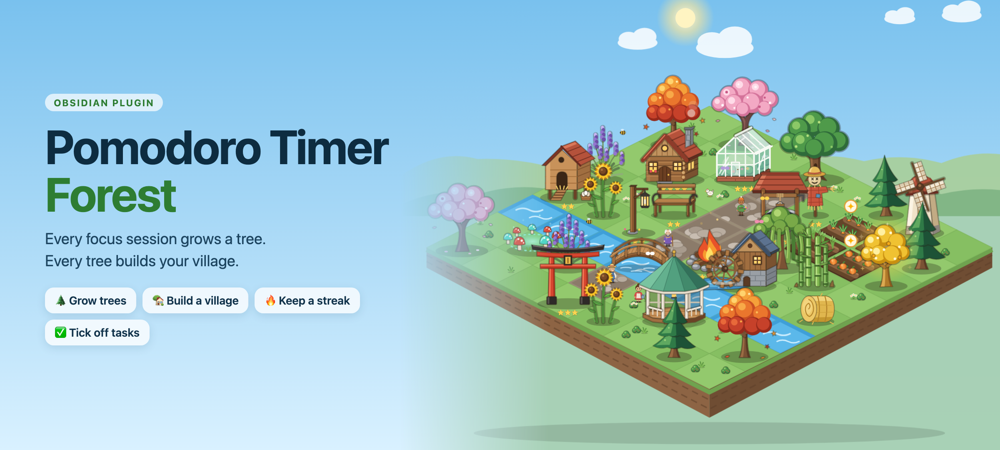
</p>

<p align="center">
  <b>Turn your focus sessions into a living village, right inside Obsidian.</b><br>
  Grow a tree with every pomodoro. Turn your trees, tasks and streaks into a village you actually want to come back to.
</p>

<p align="center">
  <a href="docs/GUIDE.md">User guide</a> ·
  <a href="#quick-start">Quick start</a> ·
  <a href="#classic-timer-features">Timer &amp; task docs</a> ·
  <a href="FOREST_SPEC.md">Technical spec</a>
</p>

---

## Why you'll keep opening it

Pomodoro timers are easy to ignore. **Pomodoro Timer Forest** gives your focus something to grow into.

| 🌱 Focus feels alive | 🏡 Progress you can see | 🔥 A reason to come back |
|---|---|---|
| The plant in your timer grows in real time, from seed to full tree. | Every session, task and streak day builds a village that reacts to how you're doing. | Daily quests, a streak, perks that grow, new things to unlock at every level. |

It's designed to motivate, **not to nag**. Missed days make the village sleepy, never broken. Rest is rewarded. Nothing you've built is ever taken away.

## Watch your tree grow

Start a session and a seed is planted inside the timer. As the minutes pass it sprouts, becomes a sapling and grows into a tree, while the ring fills up around it. Finish and you harvest it. Give up early and it withers.

<p align="center">
  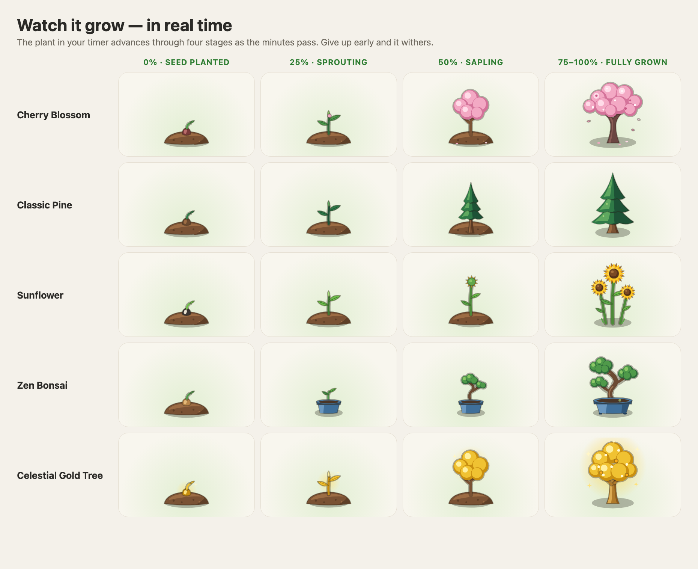
</p>

## Build a village you're proud of

Every finished tree becomes a sapling you can plant. Spend what you earn on buildings that give **real perks**: a Cozy Cabin for more Sunlight, a Village Well for more Coins, a Watermill that protects your streak while you rest. Lay paths, dig a brook, put a bridge over it, and expand your island from 5×5 up to 8×8.

Add **garden plots** and your focus grows carrots, tomatoes, wheat and pumpkins too: every focused minute grows them, every ticked task waters them, and a crop never wilts while you're away. A scarecrow speeds them up, and a chicken coop brings hens and fresh eggs for your first tree of the day.

<p align="center">
  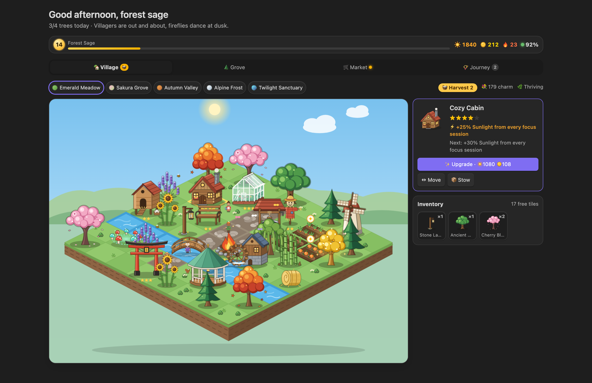
</p>

Open it as a full-page tab, or keep a compact version in the sidebar under the timer.

## A village that lives on your clock

The sky follows your real time of day. Windows glow at dusk, fireflies come out at night, sails turn, chimneys smoke and villagers stroll the paths, stop by the well and gather at the campfire after dark. Click one and they'll tell you how your day is going. When you've been away the village gets a little sleepier, and one session wakes it back up.

<p align="center">
  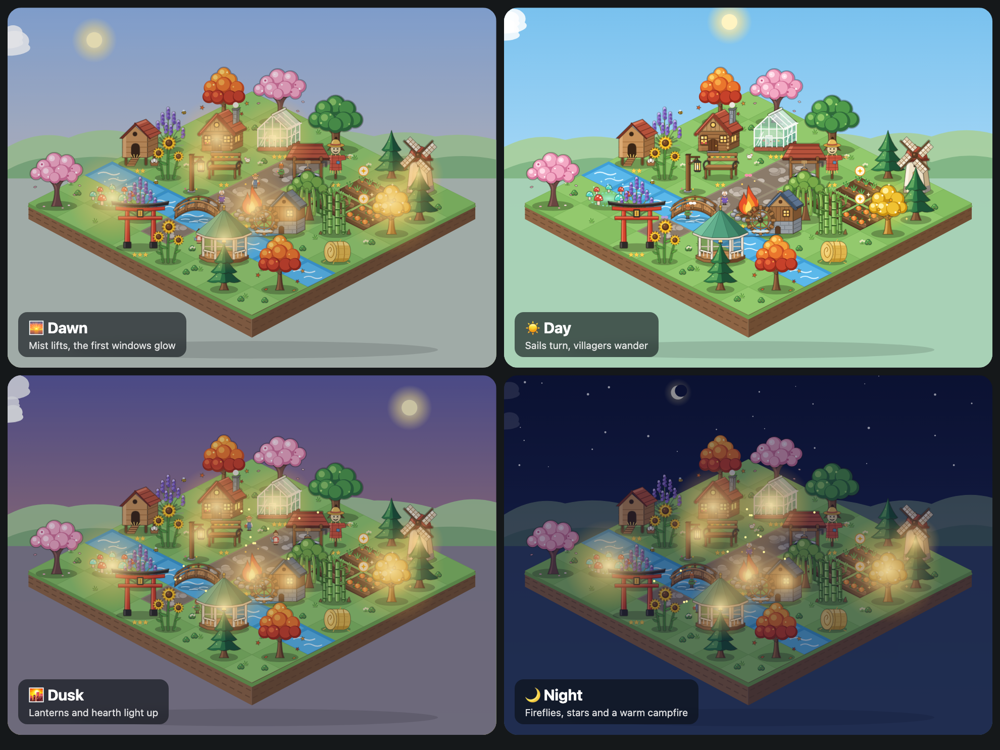
</p>

## Five biomes, eleven species, thirteen buildings

Unlock new species as you level up: from a humble Classic Pine to a glowing Celestial Gold Tree. Give your village a new mood with five biomes.

<p align="center">
  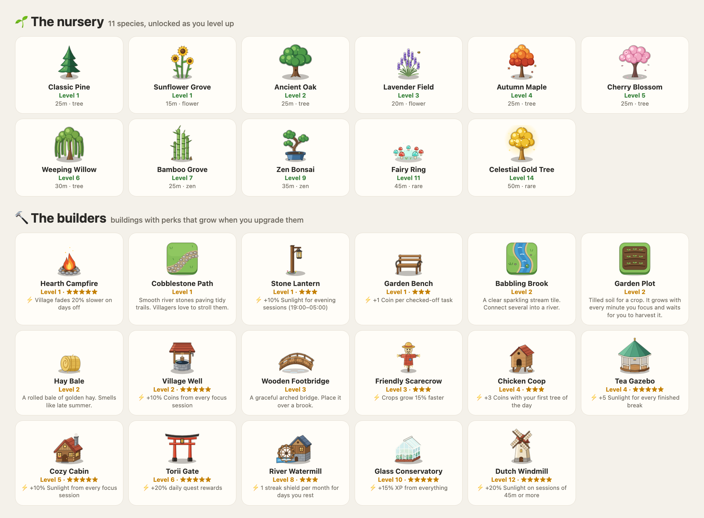
</p>

<p align="center">
  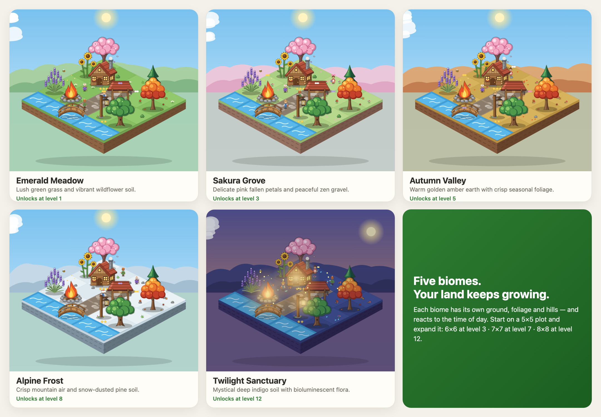
</p>

## Everything in the sidebar

<table>
  <tr>
    <td align="center" valign="top" width="25%">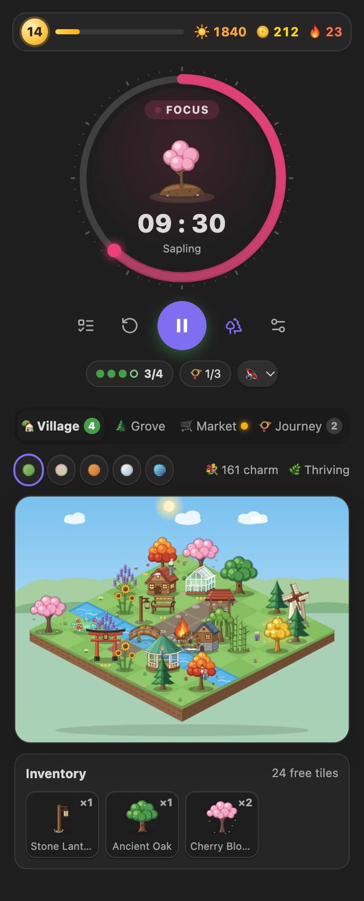<br><sub><b>Focus &amp; village</b><br>A growing plant inside the timer, your goal for the day, and the village right beneath it.</sub></td>
    <td align="center" valign="top" width="25%">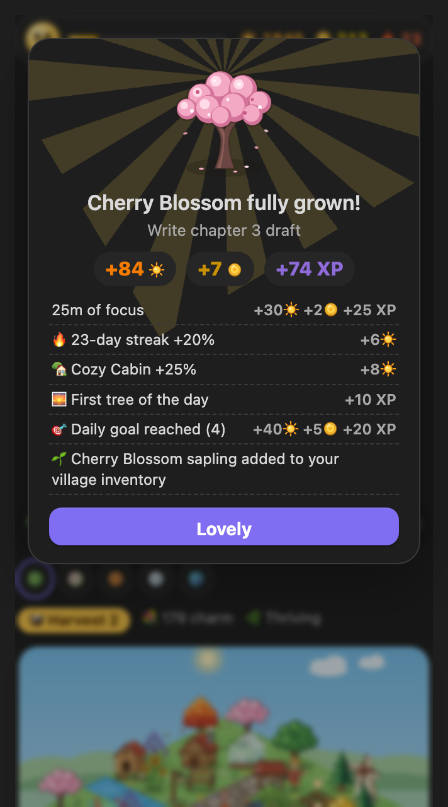<br><sub><b>Harvest</b><br>Every bonus is itemised, so you see exactly what you earned.</sub></td>
    <td align="center" valign="top" width="25%">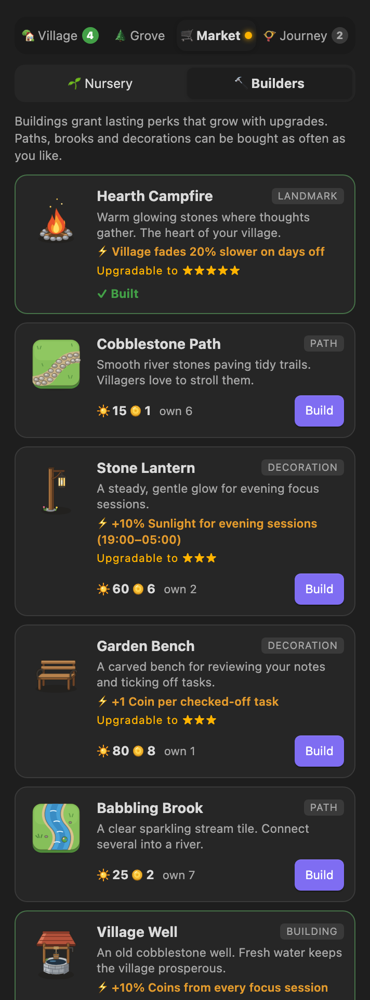<br><sub><b>Market</b><br>Buildings with perks that grow when you upgrade them.</sub></td>
    <td align="center" valign="top" width="25%">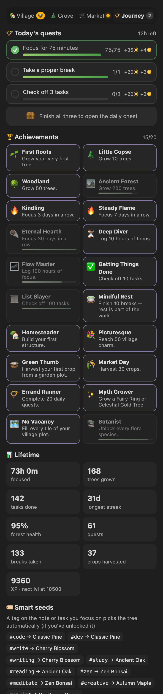<br><sub><b>Journey</b><br>Daily quests, a chest, 20 achievements and your lifetime stats.</sub></td>
  </tr>
</table>

## Kanban boards that keep work moving

Plan in lanes, focus on one card at a time, and watch the work actually get finished. Boards are plain markdown in the **[Kanban plugin](https://github.com/mgmeyers/obsidian-kanban)'s file format**, so the boards you already have open here as they are, and every board you make here still opens in the Kanban plugin.

<p align="center">
  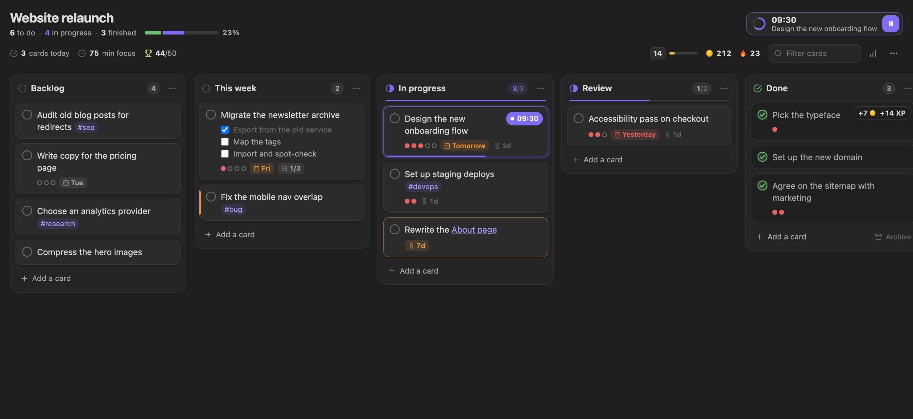
</p>

- ▶️ **Focus from the card.** Press play on any card: it becomes the timer's task, its 🍅 count goes up with every session, and the card shows the time left while you work. Finish the card mid-session and the timer offers to [harvest early](docs/GUIDE.md#done-early-harvest-early).
- ✅ **Finishing pays, and planning well pays more.** Moving a card into a done lane (or ticking it off) earns Coins and XP, with extra for the pomodoros behind it, for an estimate that was on target, for meeting its due date and for keeping your lanes within their limits.
- 🌊 **Limits, ageing and momentum.** Card limits on lanes (`## Doing (3)`), a gentle marker on cards that have waited too long in progress, and statistics for each board: cards finished per day, cycle time, estimate accuracy and milestones at 10, 25, 50… cards.
- 🧩 **Works with what you have.** Kanban dates (`@{2025-10-03}`), Tasks emoji fields, checklists inside cards, links, tags, block IDs, the Complete lane and the archive all carry over. If you keep using the Kanban plugin, cards finished there are rewarded too.

<table>
  <tr>
    <td align="center" valign="top" width="50%">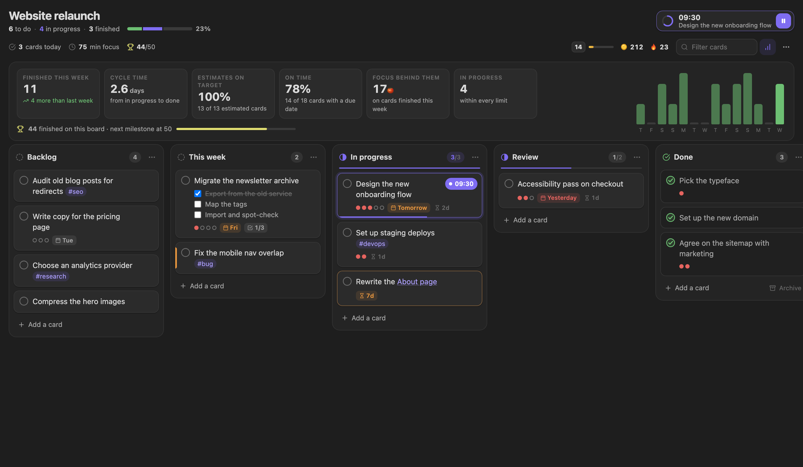<br><sub><b>Board statistics</b>: throughput, cycle time and how good your estimates are.</sub></td>
    <td align="center" valign="top" width="50%">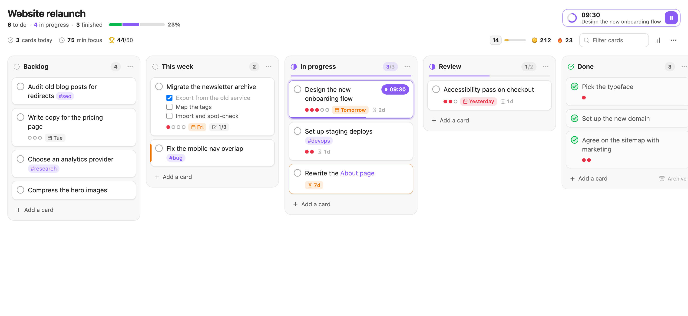<br><sub><b>Light or dark</b>: boards follow your Obsidian theme.</sub></td>
  </tr>
</table>

## Made for how you actually work in Obsidian

- 🗂️ **Kanban boards built in.** Open your existing Kanban boards, or create one with *Create a new board*. See [above](#kanban-boards-that-keep-work-moving).
- ✅ **Tick a task, earn a reward.** Check off a `- [ ]` task anywhere in your vault and it earns Coins and XP. Only real ticks count: pasting in already-checked tasks or toggling one back and forth earns nothing, and there's a daily cap.
- 🌿 **Done early? Harvest early.** Tick off the task you're focusing on and the timer offers to end the session: a young tree and most of the rewards for the minutes you focused, and nothing withers. Finishing the full session still pays the most, so ticking off tiny tasks can't be farmed.
- 🏷️ **Smart seeds.** `#write` plants a Cherry Blossom, `#code` a Pine, `#study` an Oak. Your notes and tasks choose the tree.
- 🍅 **Task tracking, built in.** Focus on a task and its pomodoro count updates automatically (enable it in settings). Plan pomodoros and set start and due dates from the panel, and pin several notes to keep their tasks in one list.
- 📓 **Daily-note logging.** Every tree can add a Dataview-friendly line to your daily note.
- 🌲 **The Grove journal.** Browse any past day as a small island of the trees you grew, with a four-week activity map.
- 📯 **Daily quests & a chest.** Three fresh quests every morning, such as *Take a proper break* or *Check off 3 tasks*. Finish them all for a chest.
- 🎧 **Ambient soundscapes.** Rain, a forest stream or a breeze while you focus, all synthesized with no audio files.
- 🔒 **Local and private.** Everything is stored in your vault. No accounts, no network requests.

<table>
  <tr>
    <td align="center" valign="top" width="50%">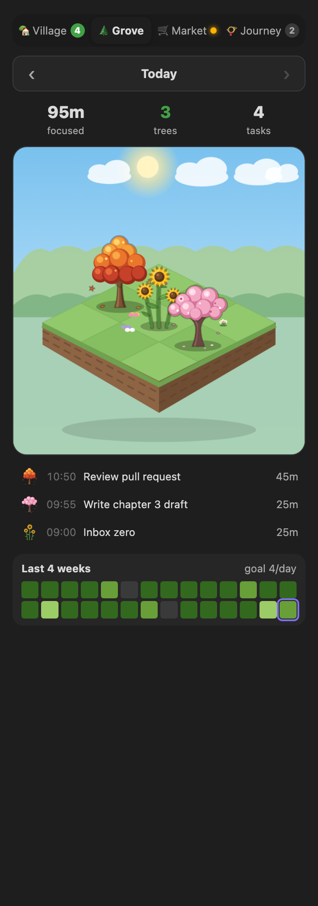<br><sub><b>The Grove</b>: today's trees and a four-week activity map.</sub></td>
    <td align="center" valign="top" width="50%">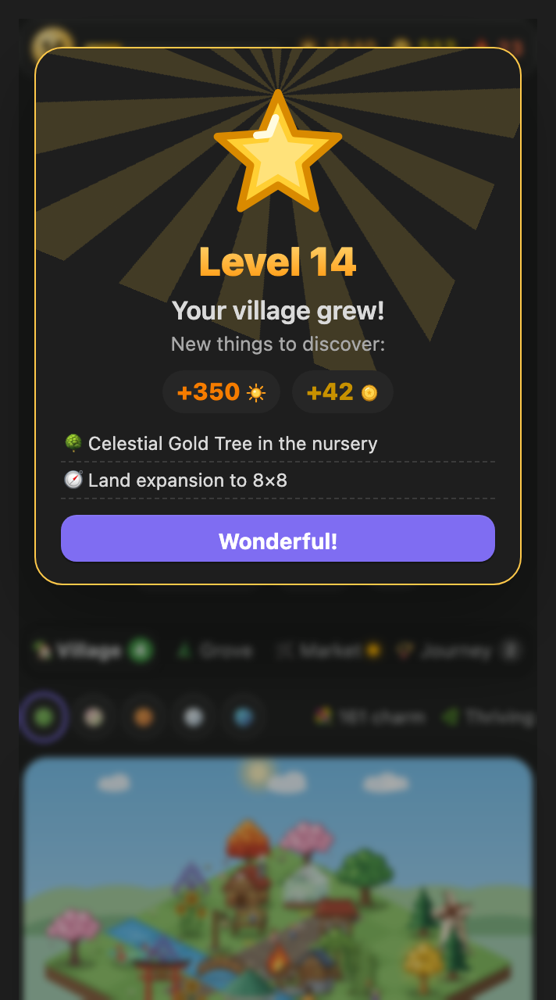<br><sub><b>Level up</b>: new species, buildings, biomes and land.</sub></td>
  </tr>
</table>

## Share your village

One click exports a **self-contained HTML snapshot** of your village, with its animated scenery, that opens in any browser, or a JSON summary for building your own dashboard.

## Quick start

1. **Install.** Copy `main.js`, `manifest.json` and `styles.css` into `<your vault>/.obsidian/plugins/pomodoro-timer-forest/` and enable the plugin under *Settings → Community plugins*. To build them yourself: `npm install && npm run build`.
2. **Open it.** Click the timer icon in the ribbon (or run *Open timer panel in the right sidebar*). For the full-page village, click the trees icon or run *Open homestead village (full view)*.
3. **Press play.** Your first tree (Classic Pine) is free, and you start with a couple of saplings to plant.
4. **Plant, build, level up.** See the [user guide](docs/GUIDE.md) for how rewards, quests, perks and streaks work.

## Permissions and privacy

- **No network requests, no accounts, no telemetry.** Everything stays in your vault.
- **Vault files:** the plugin only reads or writes notes for features you turn on: task tracking (updates the `[🍅:: …]` field on the task you focus on), session logging (daily, weekly or a chosen note), the optional daily-note line for each tree, and the Kanban boards you open with it (each change you make on a board is written to that note, and focusing a card gives it a block ID such as `^a1b2c3`). Its own data is saved in the plugin's `data.json`.
- **Clipboard:** written only when you press *Copy dashboard JSON* (or run the matching command).
- **Notifications:** system notifications are optional and use the browser's Notification API. Otherwise you get an in-app notice.

<sub>The images above are rendered by the plugin's own components and renderer using a sample level-14 village.</sub>

## Your progress: devices, backups and uninstalling

- **Progress lives in one file:** `.obsidian/plugins/pomodoro-timer-forest/data.json`.
- **Several devices:** the plugin doesn't sync by itself. Include that file in your sync tool (Obsidian Sync, the Git plugin…) and your village follows you. The plugin reloads the file when the sync tool updates it and never saves over newer synced progress. See the [guide](docs/GUIDE.md#using-more-than-one-device).
- **Uninstalling deletes your progress.** Removing the plugin removes its folder, including `data.json`. If you might return, copy the file somewhere safe first and put it back after reinstalling. The plugin is still evolving, so older saves are upgraded on load but not guaranteed to work forever. Steps in the [guide](docs/GUIDE.md#uninstalling-without-losing-your-progress).

---

# Classic timer features

The game layer sits on top of a full-featured Pomodoro timer for Obsidian:

-   **Customizable Timer**: Set your work and break intervals to suit your productivity style.
-   **Audible Alerts**: Stay on track with audio notifications signaling the end of each session.
-   **Status Bar Display**: Monitor your progress directly from Obsidian's status bar to keep focusing.
-   **Daily Note Integration**: Automatically log your sessions in your daily notes for better tracking.
-   **Task Tracking**: Plan pomodoros, set start and due dates and pin several notes from the task panel, with the count refreshed for the task in focus.

## Notification

### Custom Notification Sound

1. Put the audio file into your vault.
2. Set its path ralative to the vault's root.
   For example: your audio file is in `AudioFiles` and named `notification.mp3`, your path would be `AudioFiles/notification.mp3`.
   **Don't forget the file extension (like `.mp3`, `.wav` etc.).**
3. Click the `play` button next to the path to verify the audio

## Task Tracking

The **Tasks** panel (the checklist icon under the timer) lists the tasks of the note you are working in, plus every note you have pinned.

<table>
  <tr>
    <td align="center" valign="top" width="50%">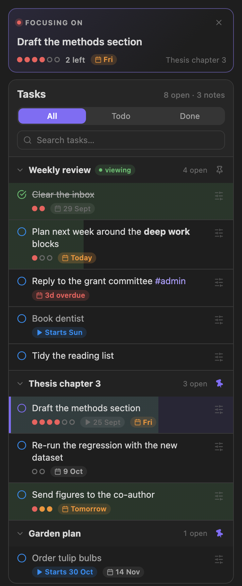<br><sub><b>One list, several notes</b><br>The note you are in, plus everything you pinned.</sub></td>
    <td align="center" valign="top" width="50%">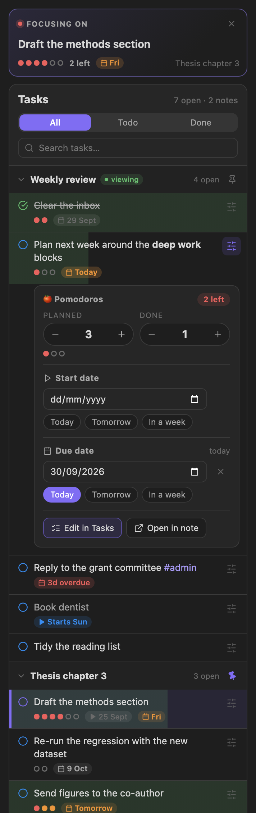<br><sub><b>Plan without typing</b><br>Pomodoros, start date and due date, right under the task.</sub></td>
  </tr>
</table>

-   **Focus a task** by clicking it. The timer counts its pomodoros, and the session is logged against it. Right-click a task for more actions.
-   **Pin notes.** Click the pin next to a note's name to keep its tasks in the panel while you work in other notes. Pin as many notes as you like; pins are remembered between sessions. When you open another note, its tasks appear first, followed by your pinned notes. A task you are focusing on stays focused while its note is pinned, or while a focus session is running.
-   **Plan and schedule from the panel.** The sliders button on a task opens its editor: how many pomodoros it should take, how many are done (with the number left shown), a start date and a due date. Changes are written straight to the task's line in your note, and the rest of the line is left alone.
-   **Edit in Tasks.** With the [Tasks](https://github.com/obsidian-tasks-group/obsidian-tasks) plugin installed, the editor also has an **Edit in Tasks** button. It opens the Tasks plugin's own editor (priority, recurrence, every date, status) through the plugin's public API and writes the result back to the line.
-   **Count sessions automatically.** Turn on *Enable task tracking* in the settings. Every finished focus session then adds one to the focused task's count. Without it, the panel still works, and you can adjust the count by hand.

This is what ends up in your note:

```markdown
-   [ ] Draft the methods section [🍅:: 4/6] 🛫 2025-09-25 📅 2025-10-03
```

`4/6` is four pomodoros done out of six planned. Dates follow the *Task format* setting: the Tasks emoji format shown above, or Dataview fields (`[start:: 2025-09-25] [due:: 2025-10-03]`).

### Typing it by hand

The panel is optional; you can still write the field yourself after the task's text. Enable tracking in the settings and the timer updates the count at the end of each work session.

**Important: Ensure to add this inline-field before the [Tasks](https://github.com/obsidian-tasks-group/obsidian-tasks) plugin's fields. Placing it elsewhere may result in incorrect rendering within the Tasks Plugin.** The panel always puts it there.

```markdown
-   [ ] Task with specified expected and actual pomodoros fields [🍅:: 3/10]
-   [ ] Task with only the actual pomodoros field [🍅:: 5]
-   [ ] With Task plugin enabled [🍅:: 5] ➕ 2023-12-29 📅 2024-01-10
```

## Log

### Log Format

The standard log formats are as follows
For those requiring more detailed logging, consider setting up a custom [log template](#Custom Log Template) as described below.

**Simple**

```
**WORK(25m)**: 20:16 - 20:17
**BREAK(25m)**: 20:16 - 20:17
```

**Verbose**

```plain
- 🍅 (pomodoro::WORK) (duration:: 25m) (begin:: 2023-12-20 15:57) - (end:: 2023-12-20 15:58)
- 🥤 (pomodoro::BREAK) (duration:: 25m) (begin:: 2023-12-20 16:06) - (end:: 2023-12-20 16:07)
```

### Custom Log Template (Optional)

1. Install the [Templater](https://github.com/SilentVoid13/Templater) plugin.
2. Compose your log template script using the `log` object, which stores session information.

```javascript
// TimerLog
{
    duration: number,  // duratin in minutes
    session: number,   // session length
    finished: boolean, // if the session is finished?
    mode: string,      // 'WORK' or 'BREAK'
    begin: Moment,     // start time
    end: Moment,       // end time
    task: TaskItem,    // focused task
}

// TaskItem
{
    path: string,         // task file path
    fileName: string,     // task file name
    text: string,         // the full text of the task
    name: string,         // editable task name (default: task description)
    status: string,       // task checkbox symbol
    blockLink: string,    // block link id of the task
    checked: boolean,     // if the task's checkbox checked
    done: string,         // done date
    due: string,          // due date
    created: string,      // created date
    cancelled: string,    // cancelled date
    scheduled: string,    // scheduled date
    start: string,        // start date
    description: string,  // task description
    priority: string,     // task priority
    recurrence: string,   // task recurrence rule
    tags: string[],       // task tags
	expected: number,     // expected pomodoros
	actual: number        // actual pomodoros
}
```

here is an example

```javascript
<%*
if (log.mode == "WORK") {
  if (!log.finished) {
    tR = `🟡 Focused ${log.task.name} ${log.duration} / ${log.session} minutes`;
  } else {
    tR = `🍅 Focused ${log.task.name} ${log.duration} minutes`;
  }
} else {
  tR = `☕️ Took a break from ${log.begin.format("HH:mm")} to ${log.end.format(
    "HH:mm"
  )}`;
}
%>
```

## Examples of Using with DataView

### Log Table

This DataView script generates a table showing Pomodoro sessions with their durations, start, and end times.


<pre>
```dataviewjs
const pages = dv.pages()
const table = dv.markdownTable(['Pomodoro','Duration', 'Begin', 'End'],
pages.file.lists
.filter(item=>item.pomodoro)
.sort(item => item.end, 'desc')
.map(item=> {

    return [item.pomodoro, `${item.duration.as('minutes')} m`, item.begin, item.end]
})
)
dv.paragraph(table)

```  
</pre>

### Summary View

This DataView script presents a summary of Pomodoro sessions, categorized by date.


<pre>
```dataviewjs
const pages = dv.pages();
const emoji = "🍅";
dv.table(
  ["Date", "Pomodoros", "Total"],
  pages.file.lists
    .filter((item) => item?.pomodoro == "WORK")
    .groupBy((item) => {
      if (item.end && item.end.length >= 10) {
        return item.end.substring(0, 10);
      } else {
        return "Unknown Date";
      }
    })
    .map((group) => {
      let sum = 0;
      group.rows.forEach((row) => (sum += row.duration.as("minutes")));
      return [
        group.key,
        group.rows.length > 5
          ? `${emoji}  ${group.rows.length}`
          : `${emoji.repeat(group.rows.length)}`,
        `${sum} min`,
      ];
    })
)
```
</pre>

## CSS Variables

| Variable                       | Default            |
| ------------------------------ | ------------------ |
| --pomodoro-timer-color         | var(--text-faint)  |
| --pomodoro-timer-elapsed-color | var(--color-green) |
| --pomodoro-timer-text-color    | var(--text-normal) |
| --pomodoro-timer-dot-color     | var(--color-ted)   |

## FAQ

1. How to Switch the Session

To switch sessions, simply click on the `Work/Break` label displayed on the timer.

2. How to completely disable `Break` sessions

You can adjust the break interval setting to `0`, this will turn off `Break` sessions.

---

## Development

```bash
npm install
npm run dev     # watch build
npm run build   # type-check and production bundle
```

The README screenshots are regenerated from the plugin's real components and renderer (needs Google Chrome):

```bash
node scripts/readme-images/build.mjs
```

## Credits

Built on [**Pomodoro Timer for Obsidian**](https://github.com/eatgrass/obsidian-pomodoro-timer) by eatgrass (MIT). The timer, task tracking and logging come from that project. The Forest & Homestead game layer is added on top.
